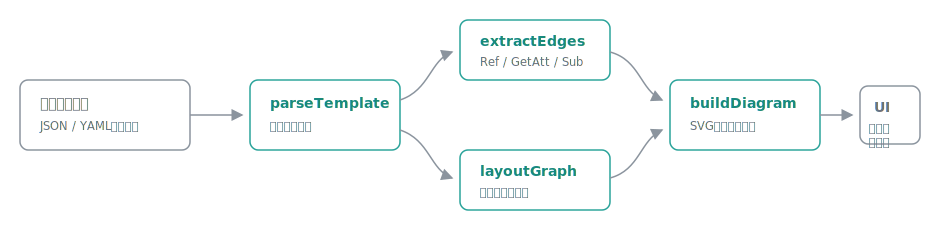

# cfnmap

[](https://github.com/miruky/cfnmap/actions/workflows/ci.yml)
[](https://www.typescriptlang.org/)
[](https://vitest.dev/)
[](https://opensource.org/licenses/MIT)

**CloudFormation / CDKテンプレートを貼ると、リソースの参照関係をたどってSVG構成図を自動生成するブラウザツールです。**

## 概要

テンプレート(JSONまたはYAML)を貼り付けると、`Ref`・`Fn::GetAtt`・`Fn::Sub`・`DependsOn` からリソース間の依存関係を抽出し、参照する側を左、される側を右に並べた構成図をその場で描画します。YAMLの短縮タグ(`!Ref` `!GetAtt` `!Sub` など)にも対応しているため、手書きのテンプレートも `cdk synth` の出力もそのまま貼れます。ノードはサービス分類ごとに塗り分けられ、クリックすると参照元・参照先とPropertiesを確認できます。生成したSVGは単体で完結したファイルとしてダウンロード・コピーでき、設計資料やREADMEにそのまま貼れます。解析はすべてブラウザ内で完結し、テンプレートが外部へ送信されることはありません。

試す: https://miruky.github.io/cfnmap/

### なぜ作ったのか

レビューや設計確認のたびに、テンプレートを上から読んでリソースの依存関係を頭の中で組み立てるのは骨が折れます。AWSコンソールのApplication Composerは多機能ですがサインインが必要で、図をドキュメントに残すにも一手間かかります。テンプレートを貼るだけで参照関係が図になり、そのままSVGとして持ち出せる軽い道具が欲しかったので作りました。

## 使い方

- テンプレートを左のエディタに貼り付けるか、サンプル(サーバーレスAPI・静的サイト配信・VPC)から選びます
- 入力のたびに右側の構成図が更新されます。実線は参照(`Ref` / `Fn::GetAtt` / `Fn::Sub`)、破線は `DependsOn` です
- ノードをクリック(またはEnter)すると、リソースタイプ・参照元・参照先・Propertiesを表示します
- 「SVGをダウンロード」「SVGをコピー」で、単体で表示できるSVGファイルとして書き出せます

## アーキテクチャ



`parseTemplate` がJSON / YAMLを正規化したリソース一覧に変換し、`extractEdges` がProperties内の組み込み関数を再帰的に走査して参照の辺を作ります。`layoutGraph` は依存の深さで列を決め、隣接列の重心で行順を整える階層レイアウトです。`buildDiagram` はこれらを束ねてスタンドアロンなSVG文字列を組み立て、UIはその文字列を表示・書き出しするだけです。全工程がDOM非依存の純粋関数で、テストはこの層に集中しています。

## 技術スタック

| カテゴリ | 技術                               |
| :------- | :--------------------------------- |
| 言語     | TypeScript 5(strict)               |
| YAML解析 | yaml(短縮タグはカスタムタグで対応) |
| ビルド   | Vite                               |
| テスト   | Vitest(34テスト)                   |
| リンタ   | ESLint + Prettier                  |
| CI / CD  | GitHub Actions                     |
| 配信     | GitHub Pages                       |

## 図の読み方

- ノードの色はサービス分類(コンピューティング・ストレージ・データベース・ネットワーク・アプリケーション統合・セキュリティ・管理)を表し、凡例が図の下に付きます
- 矢印は「参照する側 → される側」です。APIが関数を呼び、関数がテーブルを使う構成なら、左からAPI・関数・テーブルの順に並びます
- `Fn::Sub` の `${Name}` はリソース参照として辺になります。`${!Literal}` エスケープと変数マップで定義した名前、Parametersや `AWS::Region` などの疑似パラメータは辺になりません

## プロジェクト構成

- `src/lib/cfn.ts` — テンプレートの解析と正規化(JSON / YAML短縮タグ)
- `src/lib/refs.ts` — 組み込み関数の走査と参照の抽出
- `src/lib/layout.ts` — 階層レイアウトの座標計算
- `src/lib/categories.ts` — サービス分類と配色・グリフ
- `src/lib/diagram.ts` — スタンドアロンSVGの組み立て
- `src/lib/examples.ts` — サンプルテンプレート
- `src/app.ts` — エディタ・プレビュー・詳細パネルの配線
- `docs/architecture.svg` — アーキテクチャ図

## はじめ方

### 前提条件

- Node.js 20 以上

### セットアップ

```bash
git clone https://github.com/miruky/cfnmap.git
cd cfnmap
npm install
npm run dev
```

### テストの実行

```bash
npm test
```

### Lintの実行

```bash
npm run lint
```

### デプロイ

`main` ブランチへのプッシュで GitHub Actions がビルドし、GitHub Pages へ配信します。

## 設計方針

- **SVGは単体で完結させる** — 配色はSVG内の埋め込みstyleで持ち、ダウンロードした図がライト・ダーク両テーマでそのまま使えるようにする
- **解析と描画を分離する** — テンプレート解析・参照抽出・レイアウト・SVG生成を純粋関数にし、図の構造をテストで担保する
- **CDKはsynth出力を受ける** — CDKのコンストラクトツリーではなく、最終的に適用されるCloudFormationテンプレートを図にする
- **データを外に出さない** — 解析はすべてブラウザ内で完結する

## 制約

ネストされたスタック(`AWS::CloudFormation::Stack`)の中身や、`Fn::ImportValue` による別スタックへの参照は1ノードとして扱い、展開しません。SAMの `Transform` はマクロ展開前のリソースをそのまま描きます。レイアウトは自動のみで、ノードの手動配置はできません。リソース数が数百を超えるテンプレートでは図が縦長になります。

## ライセンス

[MIT](LICENSE)
